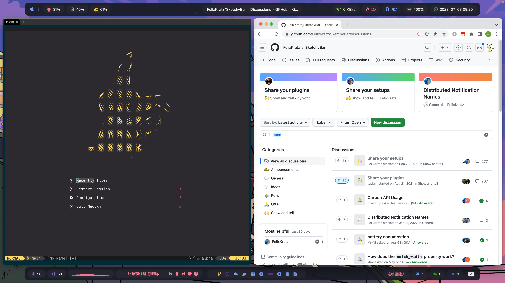

# SketchyBar

> https://github.com/FelixKratz/SketchyBar



## Installation

```sh
brew tap FelixKratz/formulae
brew install sketchybar

ln -s $(which sketchybar) $(dirname $(which sketchybar))/sketchy_topbar
ln -s $(which sketchybar) $(dirname $(which sketchybar))/sketchy_bottombar

cp -r github.com/ColaMint/config/tree/sketchybar ~/.config/
```

## Dependencies

- [Nerd Fonts](https://github.com/ryanoasis/nerd-fonts)

```sh
brew tap homebrew/cask-fonts
brew install font-hack-nerd-font
```

- [cava](https://github.com/karlstav/cava)

```sh
brew install cava
```

- [Background Music](https://github.com/kyleneideck/BackgroundMusic)

```sh
brew install --cask background-music
```

Setting "Background Music" as the system sound output device is a necessary condition for cava to work properly.

- [blueutil](https://github.com/toy/blueutil)

```sh
brew install blueutil
```

- [ifstat](https://formulae.brew.sh/formula/ifstat)

```sh
brew install ifstat
```

## Run

```sh
/opt/homebrew/bin/sketchy_topbar    --config ~/.config/sketchybar/topbarrc &
/opt/homebrew/bin/sketchy_bottombar --config ~/.config/sketchybar/bottombarrc &
```

## Notes

These Chinese software are used in my Sketchybar configuration. Please handle my configuration carefully as a reference to adapt it to your own environment.

- [NetEase Cloud Music/网易云音乐](https://apps.apple.com/cn/app/%E7%BD%91%E6%98%93%E4%BA%91%E9%9F%B3%E4%B9%90/id944848654)

- [Wechat/微信](https://apps.apple.com/us/app/wechat/id836500024)
- [Feishu/飞书](https://apps.apple.com/cn/app/%E9%A3%9E%E4%B9%A6-%E5%85%88%E8%BF%9B%E5%9B%A2%E9%98%9F-%E5%85%88%E7%94%A8%E9%A3%9E%E4%B9%A6/id1551632588)

## TODO

- The calculation of free memory in [mem.sh](https://github.com/ColaMint/config/blob/main/sketchybar/plugins/mem.sh) differs significantly from the results of other memory monitoring software.
